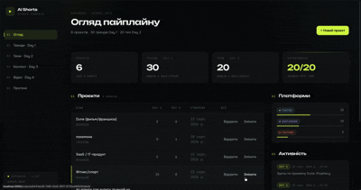
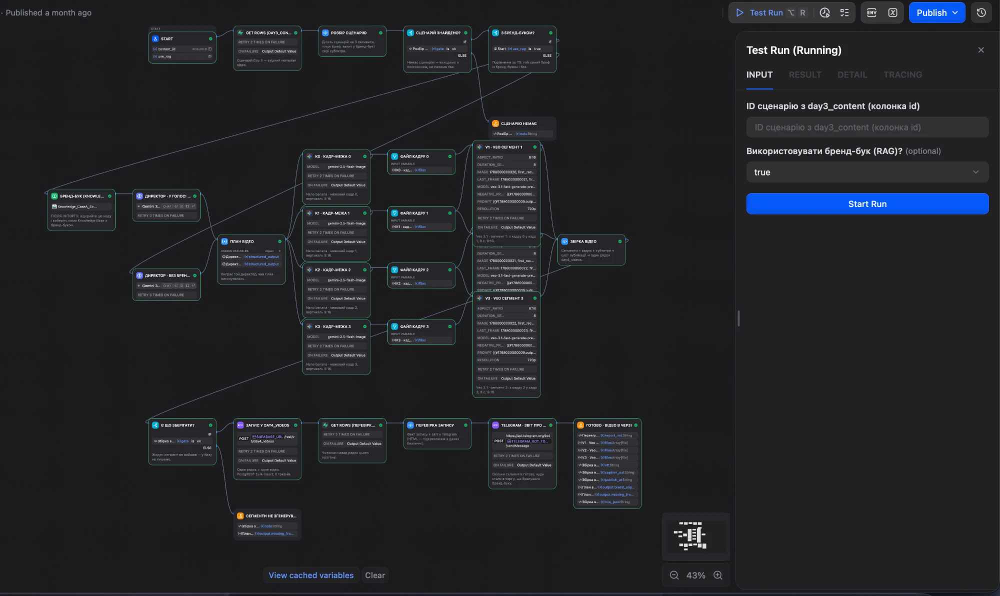

# AI Shorts Studio

Admin console and agent workflows for a short-form video content pipeline: from trend research
to a subtitled, brand-aligned vertical video that waits for a human to approve it.

> **Educational project** built during the AI agent orchestration course by Upflame.
> The workflows run on Dify; the admin panel is a Next.js app on top of Supabase.
> The demo data is a curated subset of the real course run (3 projects, 4 videos and the trends,
> topics and content behind them).

<p align="center">
  
</p>

The Day 4 workflow in Dify:



## Pipeline

| Stage | What happens | Output |
|---|---|---|
| **Day 1** · Trends | Research trends for a niche | `day1_trends` |
| **Day 2** · Topics | Turn trends into topics; a human approves or rejects each one | `day2_topics` |
| **Day 3** · Content | Producer, critic and repair agents write scripts, captions and hooks | `day3_content` |
| **Day 4** · Video | Brand book (RAG) → boundary frames → 3 Veo 3.1 segments → VTT subtitles → approval queue | `day4_videos` |

The admin panel reads and edits every stage, shows the quality rubric with its evidence, and hosts
the approval gates.

## Highlights

- **Human-in-the-loop gates.** Topics (Day 2) and finished videos (Day 4) wait in a pending state
  until a person approves them in the admin panel.
- **Independent critic.** Content is scored by a separate agent that cites evidence from the text.
  The weighted score is computed in a code node, not by a model, and capped unless evidence is quoted.
- **Write verification.** A dedicated node reads back what the flow claims to have saved. It caught
  a flow that generated 3 items but stored 2, and a Telegram payload that failed to parse.
- **Measured optimisation.** Every flow version is benchmarked through the Dify API (see below).
- **RAG comparison.** The Day 4 flow has a switch that runs the same script with or without the
  brand book, so the difference is visible side by side.
- **Deterministic work stays out of the LLM.** Niche matching, deduplication, scoring and bulk
  insert run in code nodes and cost no tokens.

## Benchmark

Median over runs; numbers come from Dify tracing and the API, not from estimates.

| Version | Change | Tokens | Time, s | Score |
|---|---|---|---|---|
| `baseline` | full-context prompts, critic rewrites the object, 3 LLM calls per item | 21,574 | 166.3 | 94.0 ⚠ |
| `iter1` | pipeline with parallel iteration, LLM agent writes rows | 37,839 | 32.3 | 81.8 |
| `final` | compact brief, critic only scores, targeted repair, bulk insert | **18,887** (−12.5 %) | **11.3** (−93.2 %) | 84.4 |

The time target was met. The token target (−30 %) was not: repair was needed for every item in the
final run, so the conditional skip of the third LLM call never triggered.
⚠ Baseline scores its own output, so 94.0 and 84.4 are not on the same scale. The full analysis
is in [DELIVERY.md](DELIVERY.md).

## Tech stack

Next.js 16 (App Router) · React 19 · TypeScript · Tailwind CSS v4 · Supabase (Postgres, JS v2) ·
Dify workflows · Gemini and Veo 3.1 · Python for DSL generation and tests

## Repository layout

```
ai-shorts-studio/
├── ai-shorts-admin/   Next.js admin panel (app/, components/, lib/, scripts/)
├── dify/              DSL generators, validator, code-node tests, exported *.public.yml flows
├── supabase/          migration, demo seed, read-only policies
├── docs/              design spec, Day 3 and Day 4 materials, screenshots
└── DELIVERY.md        course deliverable: decomposition, benchmark, reflection
```

The Dify flows are generated from a shared source (`dify/build_dsl.py`), so the baseline and final
versions differ only in what the benchmark claims they differ in.

## Getting started

Requires Node.js 20.9+ and a free [Supabase](https://supabase.com) project.

**1. Database.** In the Supabase SQL editor run
[`supabase/migrations/20260921000000_init.sql`](supabase/migrations/20260921000000_init.sql),
then [`supabase/seed.sql`](supabase/seed.sql) for the demo data. Details are in
[`supabase/README.md`](supabase/README.md).

**2. Admin panel.**

```bash
cd ai-shorts-admin
cp .env.example .env.local   # add your Supabase URL and publishable key
npm install
npm run dev                  # http://localhost:3000
```

Use the publishable key, not the service role key. Restart the dev server after editing `.env.local`.

**3. Dify flows (optional).** Import `dify/day3_final.public.yml` or `dify/day4_video.public.yml`
in Dify Studio, fill in the environment variables (`SUPABASE_URL`, `SUPABASE_KEY`,
`TELEGRAM_BOT_TOKEN`, `TELEGRAM_CHAT_ID`), attach your own knowledge base to the brand-book node
and publish.

### Commands

Run from `ai-shorts-admin/` unless noted.

| Command | Purpose |
|---|---|
| `npm run dev` / `build` / `start` | development server, production build, run the build |
| `npm run lint` | ESLint |
| `npm run bench -- --all --runs 3` | run the Day 3 flows through the Dify API and record metrics |
| `npm run bot` | Telegram bot that triggers a flow with `/gen` |
| `npm run dsl` | regenerate and validate the Dify DSL files |
| `python3 dify/test_code_nodes.py` | tests for the Day 3 code nodes (from the repo root) |

## Public demo mode

The publishable key ships to the browser. For a public deployment, run
[`supabase/policies_demo_readonly.sql`](supabase/policies_demo_readonly.sql) so the database is
read-only, and set `NEXT_PUBLIC_DEMO_MODE=true` to show a notice in the header. Reading works
everywhere; forms and approval buttons do not save anything in this mode.

When deploying to Vercel, set the project root to `ai-shorts-admin`.

## Security notes

- No secrets in the repository. The DSL generators read them from the environment or from
  `ai-shorts-admin/.env.local`; the exported `*.public.yml` files have empty credentials.
- Row-level security is **off** in the default schema (workshop mode: Dify writes with the
  publishable key). Enable the read-only policies for anything public, and add authentication
  plus proper policies before using this with real data.

## Documentation

Course materials are in Ukrainian.

- [DELIVERY.md](DELIVERY.md) — Day 3: decomposition, rubric, benchmark, defects caught, reflection
- [docs/specs](docs/specs) — Day 3 flow design
- [docs/day4-instructions.md](docs/day4-instructions.md) — Day 4 setup and the RAG on/off comparison
- [supabase/README.md](supabase/README.md) — database setup and demo policies
