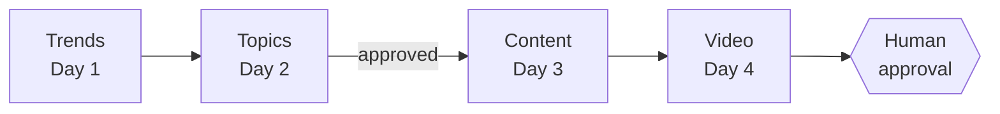
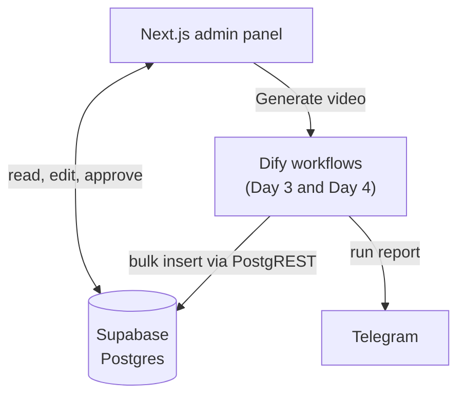

# AI Shorts Studio

**Multi-agent workflows and an admin console for a short-form video pipeline.**
From a niche and its trends to a subtitled, brand-aligned vertical video that waits for a human to approve it.

[](https://ai-shorts-studio-6b9q.vercel.app)


**[Open the live demo →](https://ai-shorts-studio-6b9q.vercel.app)** It is read-only, so you can click anything.
The data is a curated subset of a real run: 3 projects, 4 playable videos and the trends, topics and content behind them.

<p align="center">
  
</p>

> **Educational project**, built during the AI agent orchestration course by Upflame.
> The agent workflows run on Dify; the admin panel is a Next.js app on top of Supabase.

## What it does

| Stage | What happens | Stored in |
|---|---|---|
| **Day 1** · Trends | Trends for a niche, one row each, with hook ideas and hashtags | `day1_trends` |
| **Day 2** · Topics | Trends become topics; a human approves or rejects each one | `day2_topics` |
| **Day 3** · Content | Producer, critic and repair agents write scripts, captions and hooks, scored against a rubric | `day3_content` |
| **Day 4** · Video | Brand book (RAG) → 4 boundary frames → 3 Veo 3.1 segments → VTT subtitles → approval queue | `day4_videos` |

The admin panel reads and edits every stage, shows each score with the evidence behind it, plays the
videos with subtitles, and hosts the two approval gates.

## Architecture





The Day 1 and Day 2 flows are not part of this repository; their output is managed through the admin
panel. The Day 3 and Day 4 flows are exported in [`dify/`](dify).

## What this project demonstrates

- **Agent orchestration.** Producer, critic and repair agents with typed hand-offs (`structured_output`
  schemas), parallel iteration over items, and conditional routing so only failing items pay for a repair call.
- **Evaluation.** A five-criterion rubric where every score must quote evidence. The weighted score is
  computed in a code node, not by a model, and capped unless the critic cites the text.
- **Measured optimisation.** A benchmark harness runs each flow version through the Dify API and records
  tokens, time and quality per run and per node. Results below, including the target that was missed.
- **Reliability.** A verification node reads back what the flow claims to have saved. It caught a run that
  generated 3 items but stored 2, and a Telegram payload that failed to parse.
- **RAG with an A/B switch.** The Day 4 flow grounds visuals and captions in a brand book, and can run the
  same script with or without it, so the difference is visible side by side.
- **Human in the loop.** Topics and finished videos wait in a pending state until a person approves them.
- **Full-stack delivery.** Next.js App Router with Server Components and Server Actions, a relational
  schema with explicit cascade rules, ffmpeg-based video stitching, and a subtitle player that adds its
  track programmatically instead of relying on browser defaults.
- **Engineering hygiene.** Flows are generated from one source, validated (graph, references, schemas,
  secrets) and covered by 66 code-node tests. Secrets never enter the repository; migrations and a seed
  make the database reproducible; the public demo is read-only by database policy, not by convention.

## Results

Median over runs, taken from Dify tracing and the API rather than estimated.

| Version | Change | Tokens | Time, s | Score |
|---|---|---|---|---|
| `baseline` | full-context prompts, critic rewrites the object, 3 LLM calls per item | 21,574 | 166.3 | 94.0 ⚠ |
| `iter1` | pipeline with parallel iteration, an LLM agent writes the rows | 37,839 | 32.3 | 81.8 |
| `final` | compact brief, critic only scores, targeted repair, bulk insert | **18,887** (−12.5 %) | **11.3** (−93.2 %) | 84.4 |

The time target was met. The token target (−30 %) was not: repair was needed for every item in the final
run, so the step that skips the third LLM call never triggered. Replacing the LLM writer with one HTTP call
cut tokens by half compared with `iter1`.
⚠ The baseline grades its own output, so 94.0 and 84.4 are not on the same scale. Full analysis in
[DELIVERY.md](DELIVERY.md).

<details>
<summary><b>The Day 4 workflow in Dify (29 nodes)</b></summary>
<br>


</details>

## Tech stack

| Area | Tools |
|---|---|
| Admin panel | Next.js 16 (App Router), React 19, TypeScript, Tailwind CSS v4 |
| Data | Supabase (Postgres, PostgREST), SQL migrations and seed |
| Agents | Dify workflows, Gemini (text, images), Veo 3.1 (video) |
| Tooling | Python (DSL generator, validator, tests), Node.js (benchmark, Telegram bot), ffmpeg |
| Delivery | Vercel |

## Repository layout

```
ai-shorts-studio/
├── ai-shorts-admin/   Next.js admin panel (app/, components/, lib/, scripts/)
├── dify/              DSL generators, validator, code-node tests, exported *.public.yml flows
├── supabase/          migration, demo seed, read-only policies
├── docs/              design spec, Day 3 and Day 4 materials, media
└── DELIVERY.md        course deliverable: decomposition, benchmark, reflection
```

## Run it locally

Requires Node.js 20.9+ and a free [Supabase](https://supabase.com) project.

**1. Database.** In the Supabase SQL editor run
[`supabase/migrations/20260921000000_init.sql`](supabase/migrations/20260921000000_init.sql), then
[`supabase/seed.sql`](supabase/seed.sql) for the demo data. Details in [`supabase/README.md`](supabase/README.md).

**2. Admin panel.**

```bash
cd ai-shorts-admin
cp .env.example .env.local   # add your Supabase URL and publishable key
npm install
npm run dev                  # http://localhost:3000
```

Use the publishable key, not the service role key.

**3. Dify flows (optional).** Import `dify/day3_final.public.yml` or `dify/day4_video.public.yml` in Dify
Studio, fill in the environment variables (`SUPABASE_URL`, `SUPABASE_KEY`, `TELEGRAM_BOT_TOKEN`,
`TELEGRAM_CHAT_ID`), attach your own knowledge base to the brand-book node and publish.

| Command (from `ai-shorts-admin/`) | Purpose |
|---|---|
| `npm run dev` / `build` / `start` | development server, production build, run the build |
| `npm run lint` | ESLint |
| `npm run bench -- --all --runs 3` | run the Day 3 flows through the Dify API and record metrics |
| `npm run bot` | Telegram bot that triggers a flow with `/gen` |
| `npm run dsl` | regenerate and validate the Dify DSL files |
| `python3 dify/test_code_nodes.py` (repo root) | code-node tests |

## Deploying a public demo

The Supabase publishable key ships to the browser, so a public deployment should not be writable.
Run [`supabase/policies_demo_readonly.sql`](supabase/policies_demo_readonly.sql) to enable row-level
security with select-only policies, and set `NEXT_PUBLIC_DEMO_MODE=true` for a notice in the header.
On Vercel, set the project root to `ai-shorts-admin`. Reads work everywhere; forms and approval buttons
save nothing in this mode.

## Known limitations

- The default schema runs with row-level security **off** (workshop mode: Dify writes with the publishable
  key). Turn on the read-only policies for anything public, and add authentication and real policies
  before using it with production data.
- The Day 1 and Day 2 flows are not included, and the Dify knowledge base cannot travel in a DSL file, so
  the brand-book node needs your own dataset.
- The token-reduction target was not reached (see Results).

## Documentation

Course materials are in Ukrainian.

- [DELIVERY.md](DELIVERY.md): decomposition, rubric, benchmark, defects caught, reflection
- [docs/specs](docs/specs): Day 3 flow design
- [docs/day4-instructions.md](docs/day4-instructions.md): Day 4 setup and the RAG on/off comparison
- [supabase/README.md](supabase/README.md): database setup and demo policies

---

Built by [Nujabesuuu](https://github.com/Nujabesuuu).
